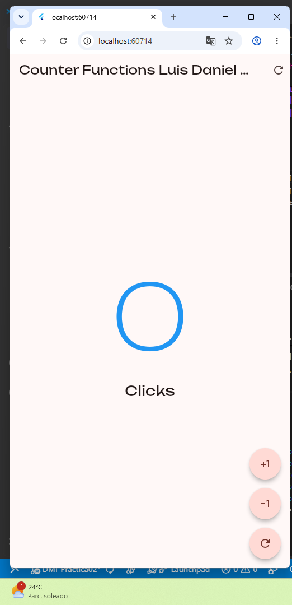
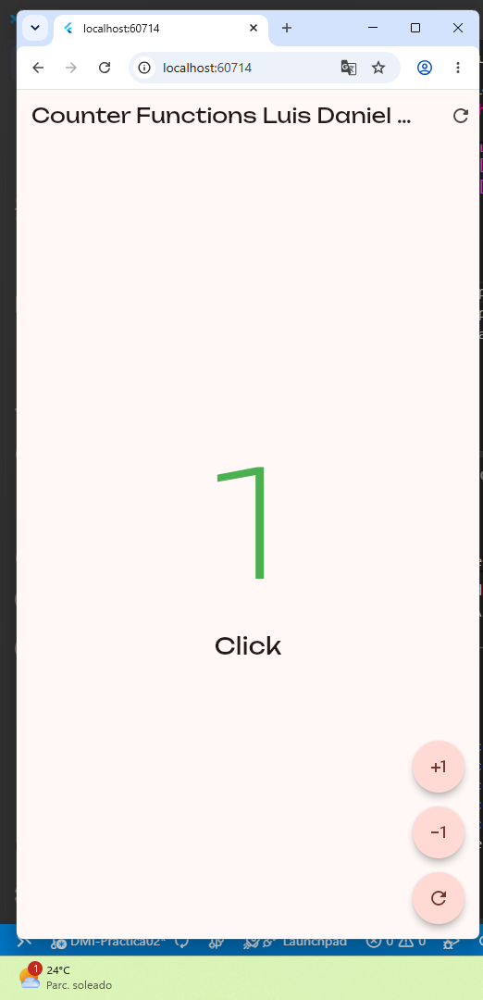
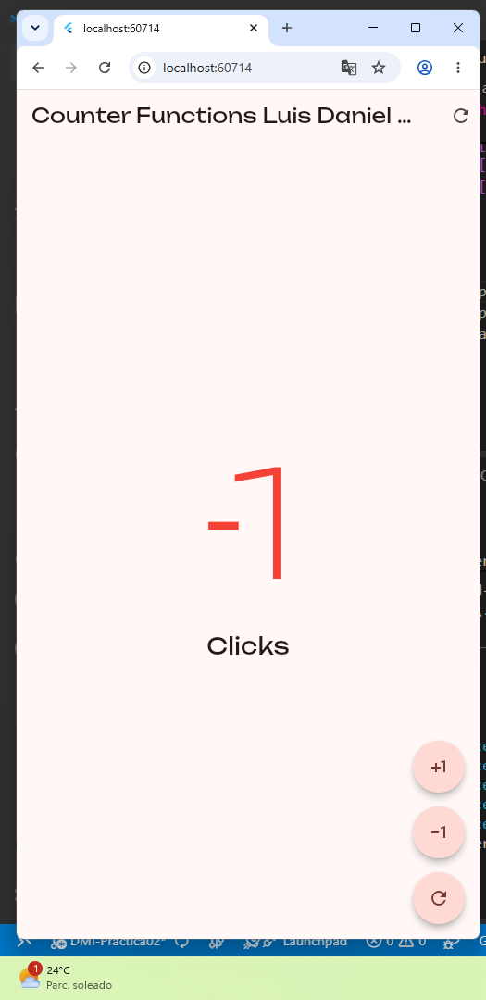

# hello_world_app_230040

Aplicacion Flutter desarrollada para la practica 02 de Desarrollo Movil Integral.

## Descripcion

El proyecto implementa una pantalla de contador interactiva para practicar el uso
de widgets con estado en Flutter. La aplicacion permite:

- Incrementar el contador.
- Decrementar el contador.
- Reiniciar el valor a cero.
- Mostrar el color del contador segun su valor: azul en cero, verde en valores
  positivos y rojo en valores negativos.
- Adaptar el texto entre `Click` y `Clicks`.

La interfaz utiliza Material 3, iconos de Material y la tipografia **Unbounded**
mediante el paquete `google_fonts`.

## Tecnologias

- Flutter
- Dart
- Material 3
- Google Fonts

## Ejecucion

Desde esta carpeta, instala las dependencias y ejecuta la aplicacion en el
dispositivo o navegador disponible:

```bash
flutter pub get
flutter run
```

## Evidencias



