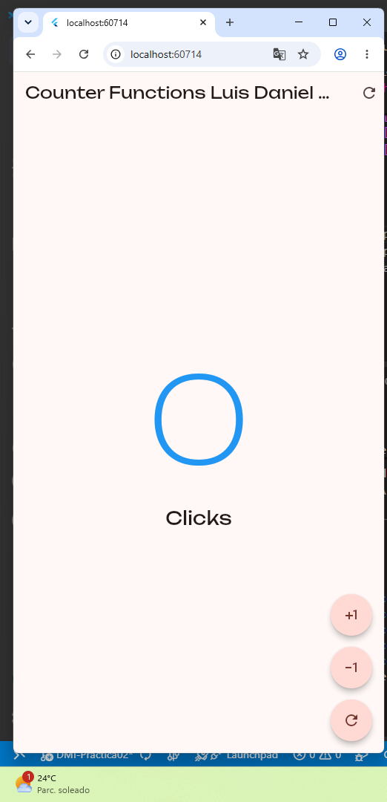
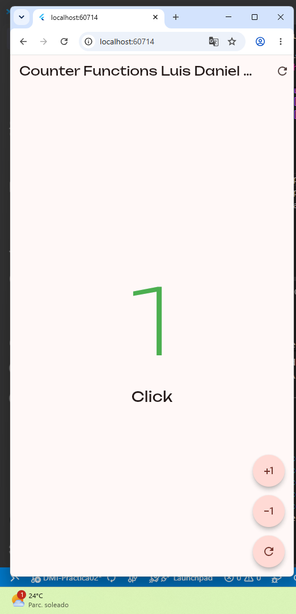
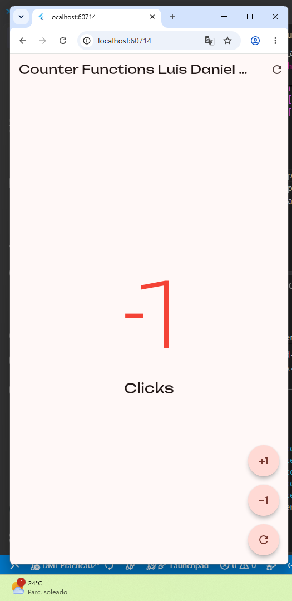

# Práctica 02: Mi primera aplicación móvil con Flutter

Aplicación Flutter desarrollada para la materia **Desarrollo Móvil Integral**. El ejercicio practica la composición de widgets, el manejo de estado y la interacción mediante controles.

## Descripción

La aplicación presenta un contador interactivo que permite:

- Incrementar y decrementar el contador.
- Reiniciar el valor a cero.
- Cambiar el color del contador: azul cuando vale cero, verde para valores positivos y rojo para valores negativos.
- Mostrar **Click** o **Clicks** según el valor.
- Reproducir el sonido de clic del sistema al interactuar.

La interfaz utiliza Material 3 y la tipografía Unbounded mediante el paquete `google_fonts`.

## Diagrama de arquitectura

El diagrama es interactivo y estático, por lo que se puede abrir directamente desde el repositorio en GitHub Pages:

### [Ver diagrama en GitHub Pages](https://danny88e.github.io/Practicas-DMI-230040/hello_world_app_230040/architecture-diagram.html)

También puedes [abrir el HTML del diagrama en el repositorio](architecture-diagram.html) o, en Windows, ejecutar [Abrir diagrama.bat](Abrir%20diagrama.bat).

## Tecnologías

- Flutter y Dart
- Material Design 3
- `google_fonts`
- `SystemSound` de Flutter

## Ejecución

Desde esta carpeta, instala las dependencias y ejecuta la aplicación en un dispositivo o navegador disponible:

```bash
flutter pub get
flutter run
```

## Evidencias





## Recursos

- [Documentación oficial de Flutter](https://docs.flutter.dev/)
- [Codelab: tu primera aplicación Flutter](https://docs.flutter.dev/get-started/codelab)
